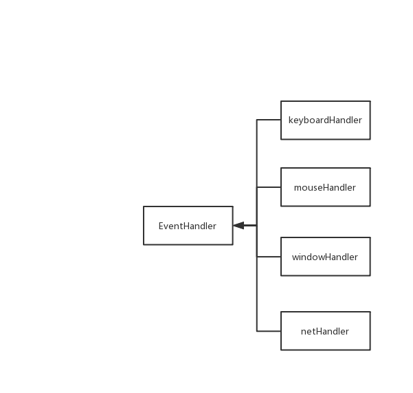
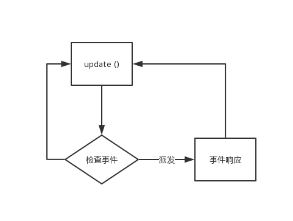

# 事件系统的设计与实现

 事件系统主要做各种I/O事件，网络事件，游戏内部事件的处理（Handle）与派发（dispatch），为组件解耦提供帮助。同时也提供线程变换的功能，避免出现子线程操作UI的情况。

## 事件系统

事件系统设计一共有两个模块
1. EventDispatcher 挂载到主线程进行循环事件以及派发事件
2. EventHandler 事件协议，需要响应事件的对象需要实现EventHandler对应的事件方法






``` cpp
class EventDispatcher final
{
	auto addEventHandler(EventHandler* handler) -> void;
	auto removeEventHandler(EventHandler* handler) -> void;
    // dispatches the event immediately
	auto dispatchEvent(std::unique_ptr<Event>&& event) -> bool;
	// posts the event for dispatching on the game or main thread
	auto postEvent(std::unique_ptr<Event>&& event) -> std::future<bool>;
	// dispatches all queued events on the game or main thread
	auto dispatchEvents() -> void;
private:
	std::vector<EventHandler *> eventHandlers;
	std::mutex eventQueueMutex;
	std::queue<std::pair<std::promise<bool>, std::unique_ptr<Event>>> eventQueue;
};


class EventHandler final
{
  public:
	friend EventDispatcher;
	static constexpr int32_t PRIORITY_MAX = 0x1000;

	explicit EventHandler(int32_t initPriority = 0) : priority(initPriority)
	{
	}
	~EventHandler();
	auto remove() -> void;
	std::function<bool(KeyEvent *)> keyboardHandler;
	std::function<bool(MouseEvent *)> mouseHandler;
	std::function<bool(WindowEvent *)> windowHandler;
	std::function<bool(InnerMessage *)> innerMessageHandler;
	std::function<bool(Event *)> customHandler;
    std::function<bool(NetEvent *)> netHandler;
  private:
	int32_t priority;
	EventDispatcher *eventDispatcher = nullptr;
};

```

#### 事件检查
事件检查时循环整体的消息队列，所有的任务进行出队操作，出队后的事件进行派发。由于队列非线程安全队列，I/O线程有可能投递消息 , 因此出队之前进行加锁处理。


``` cpp
auto EventDispatcher::dispatchEvents() -> void
{

	std::pair<std::promise<bool>, std::unique_ptr<Event>> event;
	for (;;)
	{
		std::unique_lock<std::mutex> lock(eventQueueMutex);
		if (eventQueue.empty())
			break;

		event = std::move(eventQueue.front());
		eventQueue.pop();
		lock.unlock();

		event.first.set_value(dispatchEvent(std::move(event.second)));
	}
}

```

## 主线程回调
主线程回调的基本思路与上述设计基本一致，主要是给子线程直接提供主线程回调函数的操作，类似于Android平台的
```java
 	void runOnUiThread(Runnable run);
```
这个方法使得一个Runnable 对象的run 方法能够在UI线程进行执行（实际上可以认为Runnable为一个仿函数），同时跟进这个方法的底层实现我们可以看到，这个方法利用了Handler和MainLooper，当执行这个方法的时候，会把Runnable对象投递到主线程消息队列进行派发。

但是为什么会有这样一个方法呢？

对于Android编程来说，很多情况下，我们是对界面进行操作，例如从网络取到数据之后，对界面进行修改。
同时在Android当中，非UI线程是**无法对UI进行修改的**，如果在子线程对UI进行修改，这个时候系统会抛出异常，来保证异步线程无法对UI进行修改。
这种设计的考虑在于，其底层实现所依赖的图形接口是非线程安全的。

因此在游戏引擎当中也是一样，在MapleStory的引擎实现中，底层依赖于OpenGL函数，
并且**所有的OpenGL函数都是非线程安全的**。
如果我们在异步线程收到数据并且期望改变UI状态、或者改变人物状态怎么操作呢？
根据上述Android 的实现原理，我们也可以在我们的主线程加入一个消息队里，这个消息队列处理所以异步线程投递进来的事件/回调函数，并且对消息进行处理。

* 在MapleStory的引擎实现当中，主要依赖于C++11 提供的std::function 、std::thread 进行实现。

当一个异步线程处理完成数据（从网络收到数据、或者从外设加载文件等）之后，需要对屏幕上的某个对象进行修改（例如向商店填充数据），由于我们需要使用到上下文解析出来的参数，如果对于每一种类型的解析我们都定义一种Event，随着项目的逐步扩大Event的类型也会变多、项目变得难以维护(当然必要的EventDispatcher也是必要的，事件系统如上文所示）。             

    因此依赖于C++11的特性 我们使用std::function 作为消息的主体,std::functon具有以下特点：

	1、支持lambda

	2、可以引用上下文（把上下文处的参数按照一定的方式传递到lambda中）   


当把std::function 投递到主线程队列之后，实际上真正Call到这个function的时候已经就在主线程了。
``` cpp
std::queue<std::function<void()>  executeQueue;
```

在C++中，std::queue 也是一个非线程安全的数据结构，如果在子线程投递事件的同时，主线程进行消费操作，很可能出现线程安全问题，因此在读写操作的过程中也必须加锁。

``` cpp
auto execute(std::function<void()> call) ->
{
	std::lock_guard<std::mutex> locker(executeMutex);//加锁。函数结束时自动释放锁资源
	executeQueue.push(mainCallback);
}
//当主循环update完成之后，会进行消息处理
auto executeAll() -> void
{
	std::function<void()> func;
	for (;;)
	{
		{
			std::lock_guard<std::mutex> lock(executeMutex);
			if (executeQueue.empty()) break;
			func = std::move(executeQueue.front());
			executeQueue.pop();
		}//提前释放锁资源

		if (func)
		{
			func();
		}
	}
}

auto update() -> void
{
    ...
    ...
    ...
    executeAll();
}

```