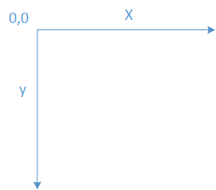
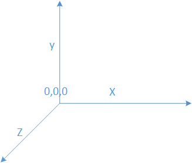
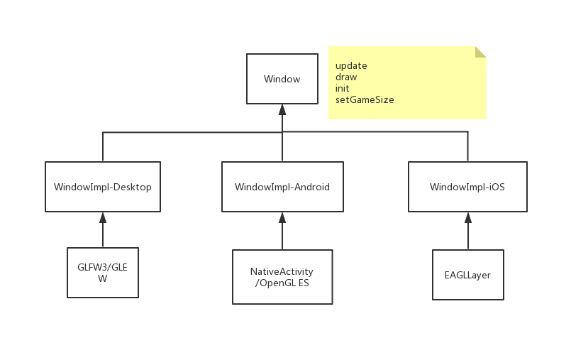

# 窗口以及坐标系

### 坐标系
屏幕坐标系统如下所示：



游戏坐标系


但是游戏坐标系的原点实际上为（-screenWidth/2，-screenHeight/2）

### GL坐标系



GL的坐标系统与冒险岛不同，以屏幕左下角为原点，因此需要进行坐标转换。

``` cpp

#version 120\n
attribute vec2 pos;
attribute vec2 coord;
attribute vec4 color;
varying vec2 texpos;
varying vec4 colormod;
uniform vec2 screensize;
void main() {
    gl_Position = vec4(-1.0 + pos.x * 2.0 /  screensize.x , 1.0 - pos.y * 2.0 / screensize.y, 0.0, 1.0);
    texpos = coord ;
    colormod = color;
};

```
其中ScreenSize 为游戏分辨率

### 窗口




窗口提供OpenGL上下文环境的初始化，游戏窗口大小设置，更新，绘图，帧率设置等操作

桌面平台需要注册各种GLFW事件的回调函数

Android iOS 手动需要封装事件
``` cpp
struct MouseEvent final : public Event {
    int32_t touchId = -1;
    double x = 0.0;
    double y = 0.0;
};

struct WindowEvent final : public Event {
    Window *window = nullptr;
    Point16 size;
};

struct KeyEvent final : public Event {
    enum KeyMode {
        NONE,
        CTRL,
        ALT,
        SHIFT,
        SUPER
    };
    int32_t keyCode = 0;
    int32_t scanCode = 0;
    KeyMode mods = NONE;
    Keyboard::Mapping mapping;
    bool character = false;
};

struct ExitEvent final : public Event {
};

struct MobSpeakEvent final : public Event {
    std::string str;
    int8_t type = 0;
};

struct InnerMessage final : public Event {
    std::u16string message;
};

struct QuestEvent final : public Event {
    int16_t questId;
    int8_t state;//0 - forfeit 1 - start or update  2 - complete
    std::string stats;
    int64_t completeTime;
};

struct FpsEvent final : public Event{
	double fps;
	double ups;
};

struct NetEvent final : public Event
{
    bool connected = false;
};
```

windows 和 macOs下窗口的创建依赖于GLFW

Android 和 iOS 分别使用原生的OpenGL es 管理


