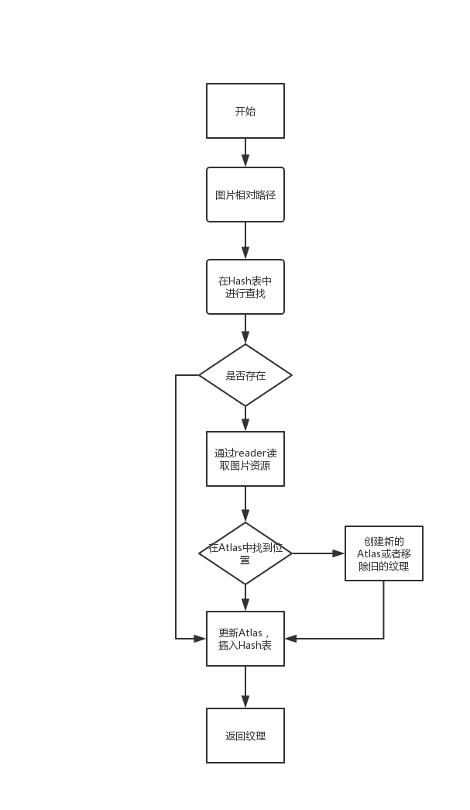
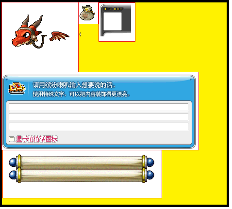
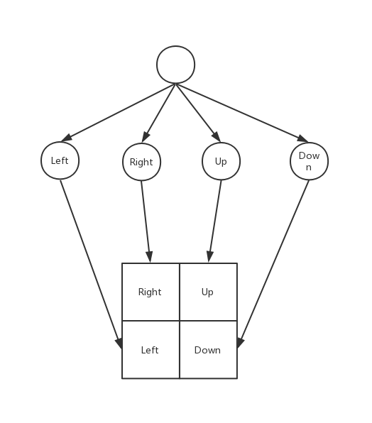
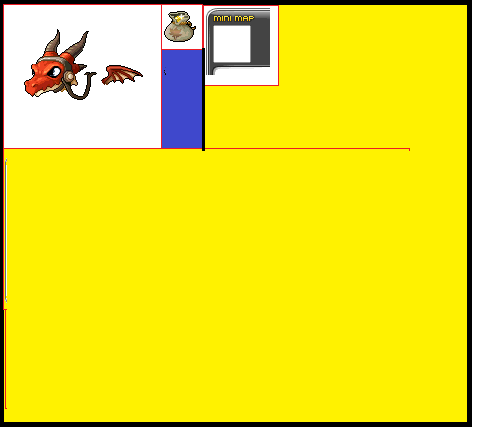
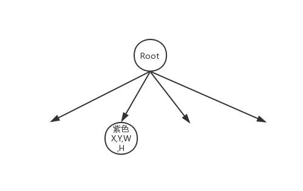
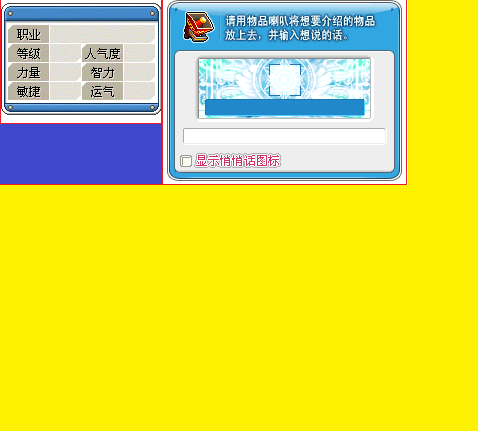
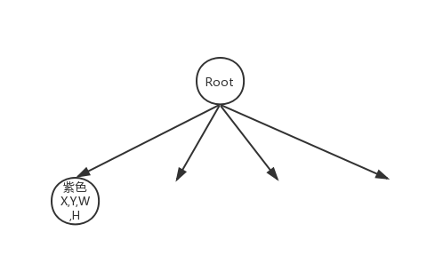
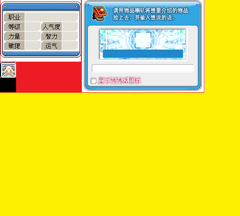
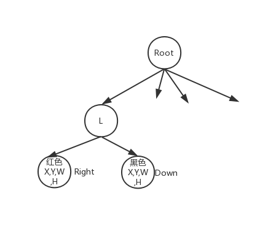

# 纹理管理

纹理管理是引擎中的重点，当需要显示图片时则需要使用图片创建一个纹理，OpenGL内部可以把纹理对象渲染出来，把图片显示出来。当使用图片时，会创建一个Texture类，然后进行管理。

### 纹理类型
冒险岛的纹理有以下几种类型

```cpp
struct color4444
{
    uint8_t b : 4;
    uint8_t g : 4;
    uint8_t r : 4;
    uint8_t a : 4;
};

struct color8888
{
    uint8_t b;
    uint8_t g;
    uint8_t r;
    uint8_t a;
};

struct color565
{
    uint16_t b : 5;
    uint16_t g : 6;
    uint16_t r : 5;
};
```
其中在客户端的资源节点的描述为：
当读取出相应的图片/纹理信息之后全部转换成**color8888**的纹理格式
``` cpp
	switch (format)
	{
	case 1:
		for (auto i = 0; i < pixels; ++i)
		{
			auto p = pixels4444[i];
			pixelsout[i] = {table4[p.r], table4[p.g], table4[p.b], table4[p.a]};
		}
		input.swap(output);
		break;
	case 2:
		for (auto i = 0; i < pixels; ++i)
		{
			auto& p = pixels8888[i];
			pixelsout[i] = {p.r, p.g, p.b, p.a};
		}
		input.swap(output);
		//if in BGRA mod, do nothing
		break;
	case 513:
		for (auto i = 0; i < pixels; ++i)
		{
			auto p = pixels565[i];

			pixelsout[i] = {table5[p.r], table6[p.g], table5[p.b], 255};
		}
		input.swap(output);
		break;
    }
```

### 数据结构

``` cpp
class Texture
{
    WzBitmap bitmap;//外存图片地址
	Point<int16_t> origin;//图片原点
	Point<int16_t> dimensions;//宽高
    int16_t order;//z渲染顺序
};
```
### 纹理管理方式
由于冒险岛含有很多的小图片，一张地图是由很多的小图片构成，因此需要考虑到**内存的碎片化**，**内存容量**，**以及渲染时的批处理渲染原则**。所以当为了提高效率，在OpenGL初始化的时候，需要先开辟2张 **4096*4096的空纹理（Atlas）**，当需要纹理加载之后，按照一定的规矩将小纹理排布到Atlas.

``` cpp
//描述每个纹理在Atlas上的相对位置
class Offset
{
  	GLshort l; //left
	GLshort r; //right
	GLshort t; //top
	GLshort b; //bottom
    GLint textId = 0;//Atlas
};
//TextureId -> Offset
std::unordered_map<size_t, Offset> offsets;

```


当前引擎中使用的缓存**纹理ID**进行实现的，加载的过的纹理都存储在TexturePool当中。

其中**纹理ID**是当前纹理所在的文件包（纹理需要从冒险岛文件系统中读取，所以地址具有唯一性）中的绝对地址

缓存纹理的过程 如下：



### 纹理在Atlas中的排布
由于不同的纹理有不同的尺寸，因此纹理在Atlas中不能进行顺序排布。如果进行顺序排布(第一行放满了，然后放第二行），整体的Atlas的空间利用率就比较低，内存的浪费就比较明显（如图，黄色的空间已经浪费掉了)



因此需要找到一种方法对黄色的空间进行利用。

## 基于四叉树的实现

四叉树本质上是对于空间进行划分，将空间划分为上下左右四个象限
(四个区域并非等宽高)



以上图为例：如果我们进行顺序（左右上下）存放，则会出现空余区域，因此对就要黄色区域进行划分

在划分之前，需要进行定义：
``` 
1.如果从左往右贴图的过程中出现后面的图片的高度小于前面的图片的高度，那么插值为空余空间，插入到四叉树上。（如紫色区域所示）
```



``` 
2.如果从左往右贴图的过程中出现后面的图片的高度大于于前面的图片的高度，那么插值为前面的空余空间，插入到四叉树上。（如紫色区域所示）
```


``` 
3.如果如果出现面积小于紫色区域的图片插入到紫色区域，并且多余的空间，插入到当前节点的子节点上
例如当前图片中的红色，黑色区域。 例外：如果当前剩下的区域长或者高小于最小节点值，当前区域舍弃
```



对于上述的过程，可以得出以下数据结构

``` cpp
//叶子信息描述为
struct LeftOver
{
	GLshort l; //left
	GLshort r; //right
	GLshort t; //top
	GLshort b; //bottom
};

struct QuadTree
{
    //四个象限;
	enum Direction
	{
		LEFT,
		RIGHT,
		UP,
		DOWN
	};

    struct Node
	{
		int32_t value; //当前节点的id值;
		LeftOver parent; //父节点位置;
		LeftOver left; //子节点位置;
		LeftOver right;
		LeftOver top;
		LeftOver bottom;
    };

    //为了提高查照效率，节点在生成的时候均会分配一个自增的id
    std::unordered_map<int32_t, Node> nodes;
};

```

## 空余空间查找
利用四叉树尽可能的索引的空余空间，因此在每次插入图片之前需要在四叉树查找是否有空余空间。
因为空间可以被划分为四个空间（上下左右），因此在查找的时候需要确认当前的图片应该插入到哪个空间中。

``` cpp
auto getDirection(const Left& first, const Left& second) -> Direction
{
    bool wComp = first.width() >= second.width();
    bool hComp = first.height() >= second.height();
    if (wComp && hComp)
    {
        return RIGHT;
    }
    if (wComp)
    {
        return DOWN;
    }
    if (hComp)
    {
        return UP;
    }
    return LEFT;
}
```
根据上述原则，在遍历的四叉树时可以得到具体的空间位置。

## 优劣分析

#### 优点：
节约内存，对内存的批量管理，不用担心内存碎片化的问题
#### 缺点：
会偶尔出现四叉树深度太深问题，效率减慢，同时没有texture的引用计数。
#### 下次重构计划
增加深度控制，增加纹理引用计数，对于长期不使用的纹理区域可以进行回收处理。