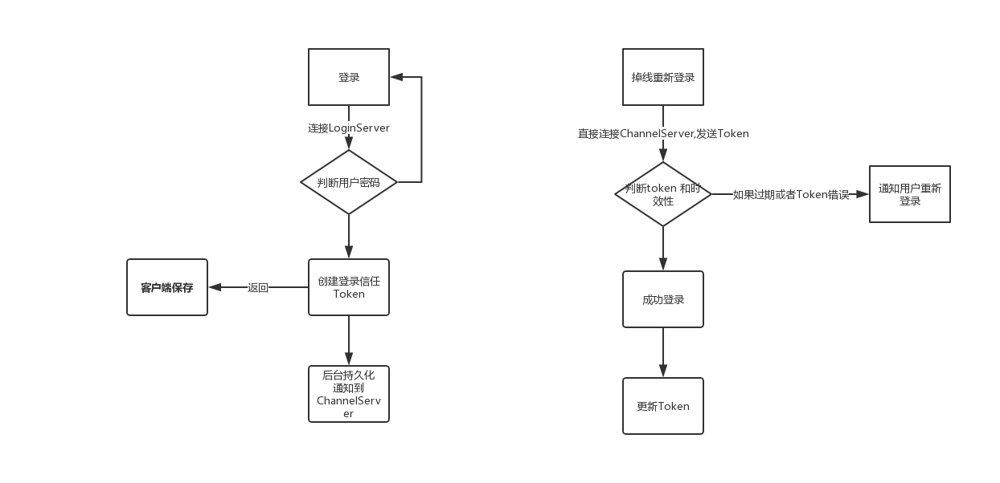

# 背景
断线重连实际上是手游必须面对的一个问题，与传统的端游相比，手游的网络环境经常发生变化并且不稳定。今天主要来探讨的就是这种断线重连机制。

首先我们讨论一下一个典型的RPG游戏的服务端架构的实现。

一个典型的RPG服务器后端一般分成三个组件，

LoginServer 负责进行登录验证，验证完成之后建立用户的单次登录信任。

ChannelServer 负责具体的后台游戏逻辑 即同时多人在线的广播者，

WorldServer 主要是做服务发现，当其中的某个Channel，Login节点离线或者上线，通知集群环境服务节点的变化。为了简化流程，以下主要讨论单节点的情况

# 用户的整个登录鉴权流程

当玩家第一次连接上服务器的时候，首先连接的是**登录服务器(LoginServer)**，用户输入账号密码之后进行登录，登录成功之后 **LoginServer** 会返回当前游戏存在的**频道数目/大区总数**，用户选择某个大区/频道上去之后，返回对应大区的角色数目。这个时候 **LoginServer** 进行鉴权操作，并持久化到DB或者别的手段通知到 **ChannelServer** 当前账号可以进入游戏。

当玩家点开始游戏的时候，断开与**LoginServer**的连接，拿到**ChannelServer**的**端口**和**ip** 连接上，成功之后发送一个进入游戏的数据包即可。

# 掉线处理。 

传统的端游当中类似DNF，冒险岛，断线之后只能**重新游戏**，即重复上述的过程。但是如果这种流程发生在手游当中，体验将会很烂。

如果在手游环境下，对上面的逻辑进行改造，使用如下的方法。

# Token的方式。
Token 顾名思义创建一个登录令牌。例如现在的微信三方登录、其他的三分登录都是使用的Token模式，详情可以参考OAuth2.0（以后可以单独开篇章在讲） 因为断线之后重新连接channel 是不会重新进行鉴权操作的，因此在这个时候需要对重连的安全性进行校验即可。
使用Token 主要是要注意的token 的时效性，和***唯一性**防止恶意绕过账号密码进行登录。

基于token 的重连模式如下所示

