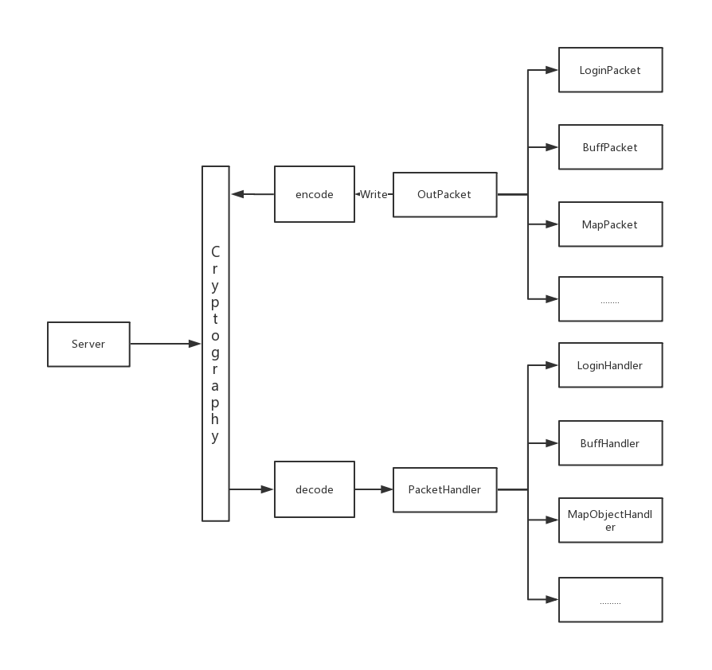
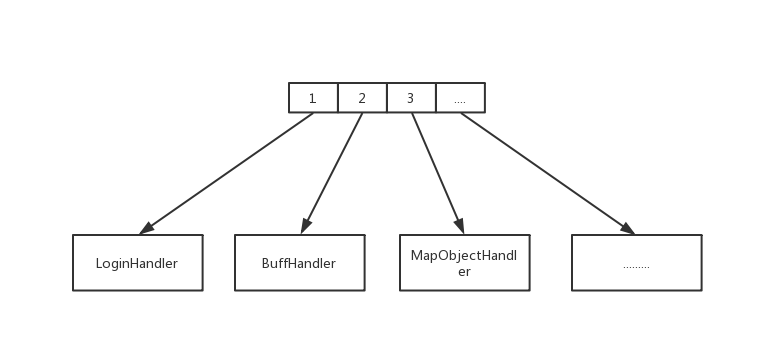
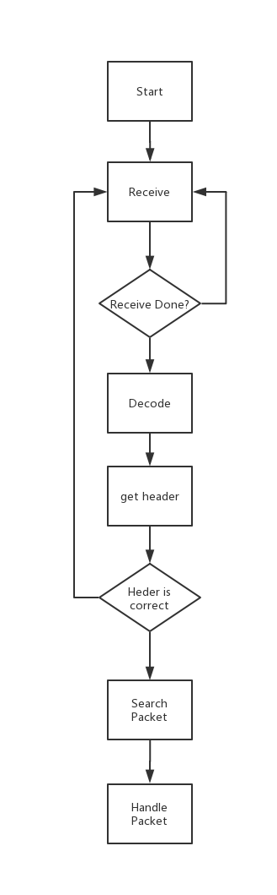

# 网络层的实现

网络层主要处理和服务端的交互，接受数据包，发送数据包，对数据包进行加密/解密

### 网络层的架构

网络层主要分为三个部分
1. OutPacket 为发送的封包的基类
2. PacketHandler 封包处理器基类，由此派生出来不同的逻辑处理器
3. 加解密模块 对封包进行加密解密操作

PacketHandler存放在指定的Hash表当中，由包头Id与对应的Handler进行对应

当收到数据包并且组装，解码完成之后进行查找操作

